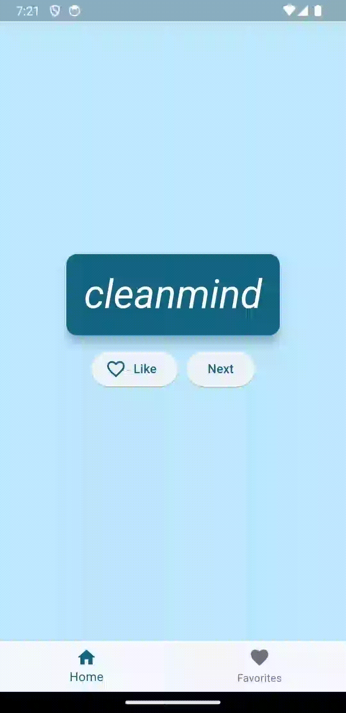
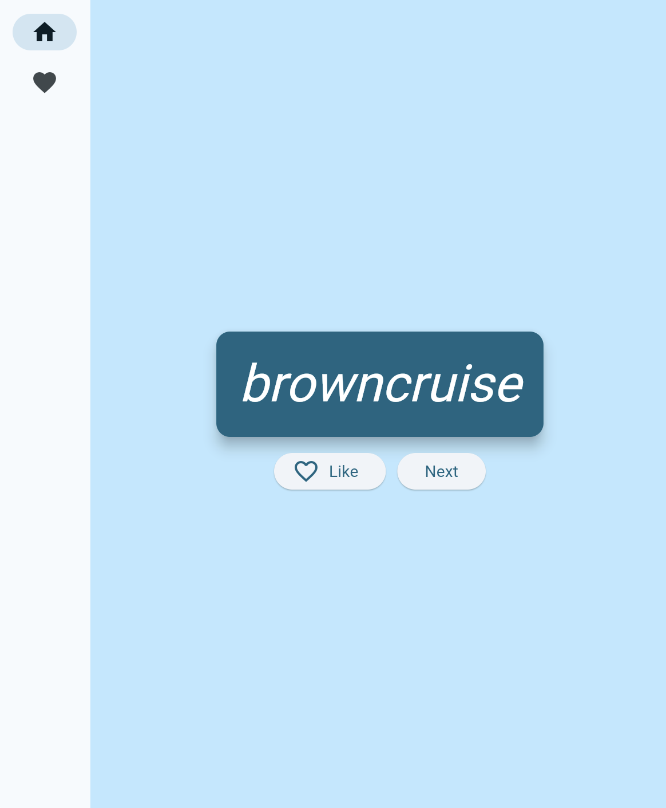

# My Favorites App

A Flutter application that generates cool-sounding word combinations and allows users to favorite and manage them.

## Table of Contents

* [Features](#features)
* [Installation](#installation)
* [Getting Started](#getting-started)
* [Built With](#built-with)
* [Contributing](#contributing)
* [License](#license)

<p align="center">
    <figcaption>The application is responsive to different screen sizes, employing a mobile-friendly layout with a BottomNavigationBar for narrow screens and a NavigationRail for wide screens</figcaption> 
</p>

## Features

- [ ] Explore the generated cool-sounding words
- [ ] Request the next word
- [ ] Favorite the word you like
- [ ] Review favorited words on the favorite page
- [ ] Remove a favorited word

## Installation

**You need to install the [Flutter SDK](https://docs.flutter.dev/) and configure the [Android toolchain development](https://docs.flutter.dev/get-started/install/windows/mobile?tab=download#configure-android-development) first and then, in order to clone the project via HTTPS, run this command:**

```git clone https://github.com/jaquedreyer/flutter-codelabs.git```

SSH URLs provide access to a Git repository via SSH, a secure protocol. If you have a SSH key registered in your Github account, clone the project using this command:

```git clone git@github.com:jaquedreyer/flutter-codelabs.git```

Navigate to the project directory:

```cd my_favorites_app```

**Install dependencies**

```flutter pub get```

## Getting Started

Run the following command in order to start the application in a development environment:

```
flutter run
```

## Built With

- Core
  - [Flutter](http://www.dropwizard.io/1.0.2/docs/) - An open source framework by Google for building multi-platform applications 
  - [Dart](https://maven.apache.org/) - The programming language 
- Packages
  - [provider](https://pub.dev/packages/provider) - State management approach
  - [english_words](https://pub.dev/packages/english_words/versions) - Used to generate cool-sounding word combinations

## Contributing

I welcome contributions and suggestions from the community! If you come across any issues, have ideas for improvements, or wish to contribute in any way, feel free to open an issue or submit a pull request.  **I would love to learn with you**! 

## License

Released in 2024. This project is licensed under the [MIT License](LICENSE.md).

> Made with love by Jaque Dreyer 🧡


